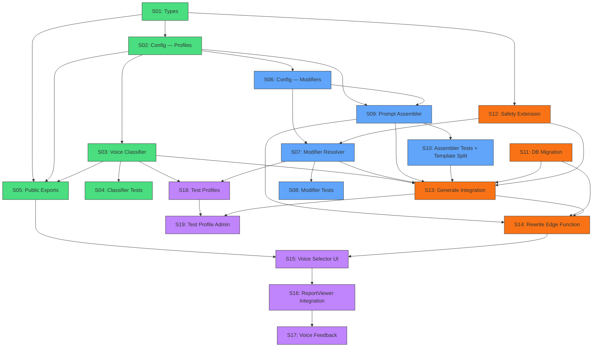

# Sprint Plan — Decoded Adaptive Narrative Voices

> **Author:** Thomas Wood + Antigravity Orchestrator  
> **Date:** June 1, 2026  
> **Version:** 1.0  
> **Status:** ✅ Approved (June 1, 2026)  
> **Phase:** 3 — Sprint Planning  
> **Architecture:** [DECODED_NARRATIVE_VOICES_ARCHITECTURE.md](file:///Users/thomaswood/Documents/Antigravity/MasteryTV/directives/DECODED_NARRATIVE_VOICES_ARCHITECTURE.md) ✅ Approved  
> **PRD:** [DECODED_NARRATIVE_VOICES_PRD.md](file:///Users/thomaswood/Documents/Antigravity/MasteryTV/directives/DECODED_NARRATIVE_VOICES_PRD.md) ✅ Approved

---

## Sprint Structure

**Estimated total:** 4 sprints (Stories are scoped to ≤1 day each)

| Sprint | Theme | Stories |
|:---|:---|:---|
| **Sprint 1** | Foundation — Types, config, classifier, tests | S01–S05 |
| **Sprint 2** | Pipeline — Modifier resolver, prompt assembler, template split | S06–S10 |
| **Sprint 3** | Integration — Generate flow, DB migration, Edge Function | S11–S14 |
| **Sprint 4** | UX — Voice selector UI, rewrite flow, feedback, test profiles | S15–S19 |

---

## Epic 1: Voice Classification System

> Build the type system, config, and classifier that maps archetypes to voices.

### S01: Type Definitions

**File:** `src/lib/decoded/report/voice/types.ts`  
**Depends on:** Nothing  
**PRD refs:** NV01, NV02, NVR34–NVR36

**Tasks:**
- [ ] Create `VoiceId` const array + type (6 voice string literals)
- [ ] Create `WritingDimensions` interface (6 dimensions, 1–10 scale)
- [ ] Create `VoiceProfile` interface (id, displayName, description, archetypes, dimensions, promptBlock, examplePhrases)
- [ ] Create `ModifierId` const array + type (4 modifier string literals)
- [ ] Create `ToneModifier` interface (id, trigger, promptBlock, voiceInteractions)
- [ ] Create `ToneModifierTrigger` type (score_threshold, interpretation_match, compound)
- [ ] Create `SectionVoiceOverride` interface
- [ ] Create `CoachDimension` type + `CoachProfileSeed` + `CoachModifierDelta` types (NVR34)
- [ ] Create `VoiceContext` interface (assembled voice state)
- [ ] Create `StoredVoiceProfile` interface (JSONB shape for assessment_reports)
- [ ] Create `ReportVersionRow` interface (assessment_report_versions table shape)

**Done when:** All types compile with zero errors. No runtime code — types only.

---

### S02: Voice Configuration — Profiles & Mappings

**File:** `src/lib/decoded/report/voice/config.ts`  
**Depends on:** S01  
**PRD refs:** NV02, NV08, NVR24–NVR26

**Tasks:**
- [ ] Create Zod schemas for `WritingDimensions`, `VoiceProfile`, `ToneModifier`, `SectionVoiceOverride`
- [ ] Define `VOICE_PROFILES` — all 6 voice profile objects with dimensions and prompt blocks:
  - [ ] The Intellectual (Architect, Sage, Strategist)
  - [ ] The Adventurer (Explorer, Catalyst, Maverick, Rebel)
  - [ ] The Connector (Advocate, Diplomat, Luminary)
  - [ ] The Steward (Sentinel, Guardian, Anchor)
  - [ ] The Challenger (Commander)
  - [ ] The Sensitive (Healer, Artist)
- [ ] Write prompt blocks for each voice (~200–400 tokens each with example phrases)
- [ ] Define `ARCHETYPE_VOICE_MAP` (16 archetypes → 6 voices)
- [ ] Define `SECTION_VOICE_OVERRIDES` (RS07 warmth+, RS08 pacing, RS12 structure)
- [ ] Define `COACH_PROFILE_SEED` mapping (NVR34 — 6 voices × 8 coach dimensions)
- [ ] Define `COACH_MODIFIER_DELTAS` mapping (4 modifiers × coach dimension deltas)
- [ ] Define `FALLBACK_VOICE = 'connector'`
- [ ] Add build-time `validateConfig()` call with Zod schemas
- [ ] Verify all 16 archetype names match `ARCHETYPE_NAMES` from `archetypes/types.ts`

**Done when:** Config imports without error. Zod validation passes. All archetype names are covered.

---

### S03: Voice Classifier

**File:** `src/lib/decoded/report/voice/voice-classifier.ts`  
**Depends on:** S01, S02  
**PRD refs:** NV01, NVR01–NVR04

**Tasks:**
- [ ] Implement `classifyVoice(archetype: ArchetypeResult): VoiceProfile`
- [ ] Map lookup from `ARCHETYPE_VOICE_MAP[archetype.primary.name]`
- [ ] Fallback to `FALLBACK_VOICE` if primary archetype name not found
- [ ] Return full `VoiceProfile` from `VOICE_PROFILES`

**Done when:** Function returns correct voice for all 16 archetypes. Fallback works for unknown inputs.

---

### S04: Voice Classifier Tests

**File:** `src/lib/decoded/report/voice/__tests__/voice-classifier.test.ts`  
**Depends on:** S03  
**PRD refs:** NVR01–NVR04

**Tasks:**
- [ ] Test all 16 archetype names → expected voice assignments
- [ ] Test determinism: same input always produces same output
- [ ] Test fallback: unknown archetype name → Connector voice
- [ ] Test blended archetype: uses primary only (not secondary)
- [ ] Verify all archetypes in `ARCHETYPE_NAMES` are covered by `ARCHETYPE_VOICE_MAP`

**Done when:** All tests pass. 100% archetype coverage verified.

---

### S05: Public API Exports

**File:** `src/lib/decoded/report/voice/index.ts`  
**Depends on:** S01, S02, S03  
**PRD refs:** NVR35

**Tasks:**
- [ ] Export `VoiceId`, `VoiceProfile`, `WritingDimensions`, `ToneModifier`, `ModifierId` types
- [ ] Export `CoachDimension`, `CoachProfileSeed`, `CoachModifierDelta` types
- [ ] Export `StoredVoiceProfile`, `VoiceContext`, `ReportVersionRow` types
- [ ] Export `classifyVoice` function
- [ ] Export `VOICE_PROFILES`, `ARCHETYPE_VOICE_MAP`, `COACH_PROFILE_SEED` from config
- [ ] Export `VOICE_IDS`, `MODIFIER_IDS` const arrays
- [ ] Verify no circular dependencies with `archetypes/`, `scoring/`, `report/prompts/`

**Done when:** Clean import from `@/lib/decoded/report/voice` works. No circular deps.

---

## Epic 2: Modifier & Prompt Pipeline

> Build the modifier resolver, prompt assembler, and integrate with the existing template system.

### S06: Tone Modifier Configuration

**File:** `src/lib/decoded/report/voice/config.ts` (extend)  
**Depends on:** S02  
**PRD refs:** NV03, NVR09–NVR14

**Tasks:**
- [ ] Define `TONE_MODIFIERS` — all 4 modifier objects:
  - [ ] Compassion Boost (SCS-SF total ≤ 2.5 OR selfJudgment ≥ 4.0)
  - [ ] Anxiety Softener (GAD-7 total ≥ 10 OR severity ∈ ["Moderate", "Severe"])
  - [ ] Emotion Regulation Buffer (DERS-16 total ≥ 52)
  - [ ] Attachment Sensitivity (ECR-R anxiety ≥ 3.5 OR attachmentStyle ∈ ["anxious", "disorganized"])
- [ ] Write prompt blocks for each modifier (~100–200 tokens each)
- [ ] Define `voiceInteractions` for each modifier (dimension adjustments per voice):
  - [ ] Compassion Boost + Challenger → reduce directness
  - [ ] Anxiety Softener + Adventurer → reduce pacing density
- [ ] Validate modifier trigger paths against `InstrumentScore` type shapes (manual check)

**Done when:** All 4 modifiers defined with prompt blocks and interaction rules. Config validates.

---

### S07: Modifier Resolver

**File:** `src/lib/decoded/report/voice/modifier-resolver.ts`  
**Depends on:** S01, S06  
**PRD refs:** NV03, NVR09–NVR14

**Tasks:**
- [ ] Implement `resolveModifiers(scores: InstrumentScore[], safetyFlags: SafetyFlags)`
- [ ] Implement `evaluateTrigger(trigger: ToneModifierTrigger, scores: InstrumentScore[])`:
  - [ ] Handle `score_threshold` type (total or subscale field, gte/lte operator)
  - [ ] Handle `interpretation_match` type (field + matchValues)
  - [ ] Handle `compound` type (AND/OR combinator with nested conditions)
- [ ] Implement safety override logic (NVR10, NVR11):
  - [ ] `highDistress` → force `compassion_boost` + `anxiety_softener`
  - [ ] `emotionalRegulationConcern` → force `emotion_regulation_buffer`
- [ ] Deduplicate: if trigger + safety both activate same modifier, include only once
- [ ] Return `{ modifiers: ToneModifier[], safetyForced: ModifierId[] }`

**Done when:** Function resolves correct modifiers for all threshold combinations. Safety overrides work.

---

### S08: Modifier Resolver Tests + Trigger Path Validation

**Files:** `__tests__/modifier-resolver.test.ts`, `__tests__/trigger-path-validation.test.ts`  
**Depends on:** S07  
**PRD refs:** NVR09–NVR14

**Tasks:**
- [ ] Test: no modifiers active (all scores above/below thresholds)
- [ ] Test: single modifier active (each of 4 modifiers individually)
- [ ] Test: all 4 modifiers active simultaneously (extreme case)
- [ ] Test: safety override forces compassion_boost + anxiety_softener when `highDistress = true`
- [ ] Test: safety override forces emotion_regulation_buffer when `emotionalRegulationConcern = true`
- [ ] Test: deduplication — safety + threshold both trigger same modifier → only one copy
- [ ] Test: compound trigger with AND combinator
- [ ] Test: compound trigger with OR combinator
- [ ] **Trigger path validation test:** Map all `ToneModifierTrigger.scoreField` paths against real `InstrumentScore` type shapes from `scoring/types.ts` — no orphaned paths

**Done when:** All tests pass. No trigger path typos.

---

### S09: Voice Prompt Assembler

**File:** `src/lib/decoded/report/voice/voice-prompt-assembler.ts`  
**Depends on:** S01, S02, S06  
**PRD refs:** NV05, NVR05–NVR08

**Tasks:**
- [ ] Implement `assembleVoicePrompt(voice, modifiers, sectionId, safetyForcedModifiers)`:
  - [ ] Start with base voice dimensions
  - [ ] Apply modifier `voiceInteractions` for this voice (dimension adjustments)
  - [ ] Apply `SECTION_VOICE_OVERRIDES` for this section (if any)
  - [ ] Compute `effectiveDimensions` (clamped 1–10)
  - [ ] Return `VoiceContext`
- [ ] Implement `buildVoicePromptBlock(ctx: VoiceContext): string`:
  - [ ] Concatenate: voice.promptBlock + modifier.promptBlocks + sectionOverride.additionalPrompt
  - [ ] Join with `\n\n`
- [ ] Implement `mergeDimensions(base, delta)` — additive merge, clamped 1–10

**Done when:** Assembler produces correct prompt blocks. Dimensions are properly merged and clamped.

---

### S10: Prompt Assembler Tests + Template Split

**Files:** `__tests__/voice-prompt-assembler.test.ts`, modify `prompts/templates.ts`  
**Depends on:** S09  
**PRD refs:** NV05, NVR05–NVR08

**Tasks:**
- [ ] Test: voice-only (no modifiers, no overrides) → voice.promptBlock only
- [ ] Test: voice + 1 modifier → voice.promptBlock + modifier.promptBlock
- [ ] Test: voice + all 4 modifiers → all 5 blocks concatenated
- [ ] Test: voice + section override (RS07) → warmth increased, directness decreased
- [ ] Test: dimension clamping — values stay within 1–10
- [ ] Test: modifier interaction — Compassion + Challenger → directness reduced
- [ ] **Modify `templates.ts`:**
  - [ ] Split `DECODED_TONE_GUIDE` into `ROLE_PREAMBLE`, `DEFAULT_VOICE_SECTION`, `RULES_AND_FORMAT`
  - [ ] Keep `DECODED_TONE_GUIDE` const for backward compatibility
  - [ ] Add optional `voicePromptBlock` parameter to `buildSectionPrompt()`
  - [ ] When `voicePromptBlock` provided, inject it between preamble and rules
  - [ ] When undefined, use original `DECODED_TONE_GUIDE` (no behavior change)
- [ ] Verify existing report generation still works with no `voicePromptBlock` argument

**Done when:** All tests pass. Template split is backward-compatible. Existing reports generate identically.

---

## Epic 3: Database & Generation Integration

> Wire the voice system into the report generation pipeline and database.

### S11: Database Migration

**File:** `supabase/migrations/20260601_add_voice_profile.sql`  
**Depends on:** Nothing (can run in parallel with Sprint 1/2)  
**PRD refs:** NVR31–NVR33, NVR36

**Tasks:**
- [ ] Add `voice_profile` JSONB column to `assessment_reports`
- [ ] Create `assessment_report_versions` table with:
  - [ ] `report_id`, `user_id`, `voice_id`, `sections` (JSONB), `status`, `sections_completed`, `total_sections`, `created_at`, `completed_at`
  - [ ] `UNIQUE (report_id, voice_id)`
  - [ ] `CHECK (status IN ('generating', 'complete', 'failed'))`
- [ ] Create `voice_feedback` table
- [ ] Set up RLS policies:
  - [ ] `assessment_report_versions`: users SELECT own rows, service_role manages all
  - [ ] `voice_feedback`: users INSERT/SELECT own rows, service_role reads all
- [ ] Create indexes: `idx_report_versions_report`, `idx_report_versions_status`, `idx_voice_feedback_voice_ids`, `idx_voice_feedback_user`
- [ ] Add column comments
- [ ] Test migration applies cleanly via Supabase MCP

**Done when:** Migration applies without errors. RLS policies verified.

---

### S12: Safety Layer Extension

**File:** `src/lib/decoded/report/safety.ts`  
**Depends on:** S01 (for `ModifierId` type)  
**PRD refs:** NVR10, NVR11

**Tasks:**
- [ ] Import `ModifierId` type from `voice/types.ts`
- [ ] Add `forceModifiers: ModifierId[]` to `SafetyFlags` interface
- [ ] Populate `forceModifiers` in `evaluateSafetyFlags()`:
  - [ ] `highDistress` → `['compassion_boost', 'anxiety_softener']`
  - [ ] `emotionalRegulationConcern` → `['emotion_regulation_buffer']`
- [ ] Ensure existing `getSafetyPromptAddendum()` still works unchanged
- [ ] Update existing tests (if any) to include `forceModifiers` in expected output

**Done when:** `SafetyFlags` includes `forceModifiers`. Existing safety behavior unchanged.

---

### S13: Report Generation Integration

**File:** `src/lib/decoded/report/generate.ts`  
**Depends on:** S03, S07, S09, S11, S12  
**PRD refs:** NVR31, NVR36

**Tasks:**
- [ ] Import `classifyVoice`, `resolveModifiers`, `assembleVoicePrompt`, `buildVoicePromptBlock`
- [ ] After archetype classification + safety evaluation:
  - [ ] Call `classifyVoice(archetypeResult)` → `VoiceProfile`
  - [ ] Call `resolveModifiers(scores, safetyFlags)` → `ToneModifier[]`
  - [ ] Build `StoredVoiceProfile` object: `{ voiceId, modifiers, classificationInput }`
- [ ] Include `voice_profile` JSONB in the report insert
- [ ] Pass `voice_profile` in the Edge Function invocation body
- [ ] The Edge Function (per-section loop) calls `assembleVoicePrompt()` + `buildVoicePromptBlock()` and passes the voice block to `buildSectionPrompt()`

**Done when:** Generated reports include `voice_profile` JSONB. Report sections use voice-adapted prompts.

---

### S14: Voice Rewrite Edge Function

**File:** `supabase/functions/decoded-rewrite-voice/index.ts`  
**Depends on:** S09, S10, S11, S13  
**PRD refs:** NV06, NVR18–NVR21

**Tasks:**
- [ ] Create Edge Function: `decoded-rewrite-voice`
- [ ] Accept `{ report_id, target_voice_id }` in request body
- [ ] Validate `target_voice_id` is a valid `VoiceId`
- [ ] Auth: verify user owns the report
- [ ] Check for existing `assessment_report_versions` row with same `(report_id, voice_id)`:
  - [ ] If `status = 'complete'` → return cached version
  - [ ] If exists → UPSERT: reset to `status = 'generating'`, clear sections
- [ ] Create/upsert version row with `status = 'generating'`
- [ ] Load scores + archetype from `assessment_scores`
- [ ] Classify voice from `target_voice_id` (override, not from archetype)
- [ ] Resolve modifiers (same scores as original)
- [ ] For each unlocked section:
  - [ ] Assemble voice prompt → call GPT-4o → write section to version row
  - [ ] Update `sections_completed` counter
- [ ] On success: set `status = 'complete'`, `completed_at = now()`
- [ ] On failure: set `status = 'failed'`, log error
- [ ] Deploy with `verify_jwt: false` (handle auth internally per KI)

**Done when:** Rewrite generates all sections in target voice. Status tracking works. Partial failure handled.

---

## Epic 4: User Experience

> Build the voice selector UI, feedback collection, and test profile system.

### S15: Voice Selector Component

**Files:** `src/app/decoded/report/[id]/VoiceSelector.tsx`, `voice-selector.css`  
**Depends on:** S05 (voice exports), S14 (rewrite function)  
**PRD refs:** NV06

**Tasks:**
- [ ] Create `VoiceSelector` component:
  - [ ] Shows current voice name + description at bottom of report
  - [ ] "Read it differently →" CTA button
  - [ ] Voice picker modal/dropdown with all 6 voices:
    - [ ] Voice name, one-line description
    - [ ] "This is how your report would sound" preview sentence
    - [ ] Current voice highlighted
    - [ ] Cached voices marked with ✓
- [ ] Style per BRAND.md: glassmorphism card, Lucide icons, type scale tokens
- [ ] On voice select: call rewrite Edge Function
- [ ] Show progress indicator during regeneration ("Regenerating in The Challenger voice... 3/12")
- [ ] Poll `assessment_report_versions` for progress updates
- [ ] On complete: swap report sections with rewritten version

**Done when:** Voice selector renders. Rewrite triggers and renders correctly. BRAND.md compliant.

---

### S16: ReportViewer Integration

**File:** `src/app/decoded/report/[id]/ReportViewer.tsx`  
**Depends on:** S15  
**PRD refs:** NV06

**Tasks:**
- [ ] Import and render `VoiceSelector` after the last report section
- [ ] Add voice state management: `currentVoiceId`, `viewingRewrite`
- [ ] When viewing a rewrite: render sections from `assessment_report_versions` instead of `assessment_reports.sections`
- [ ] Add "Back to original voice" button when viewing a rewrite
- [ ] Update narrative divider to show current voice name: "Written in The Intellectual voice"
- [ ] Ensure data visualizations stay the same across voice rewrites (only prose changes)

**Done when:** Voice selector appears in report. Rewrites render correctly. Can switch between versions.

---

### S17: Voice Feedback Component

**Files:** `src/app/decoded/report/[id]/VoiceFeedback.tsx`  
**Depends on:** S16  
**PRD refs:** NV06, NVR22–NVR23

**Tasks:**
- [ ] Create `VoiceFeedback` component:
  - [ ] Shows after reading a rewritten report (not the original)
  - [ ] "Which voice felt more like 'you'?" with original + new voice as options
  - [ ] Free-text box: "Tell us why (optional)"
  - [ ] Submit button → INSERT into `voice_feedback` table
  - [ ] Show "Thanks for your feedback" confirmation
  - [ ] Only show once per rewrite (check if feedback exists for this voice pair)
- [ ] Style per BRAND.md

**Done when:** Feedback component renders after rewrite. Data saves to `voice_feedback`. One-time show per rewrite.

---

### S18: Test Profile System

**File:** `src/lib/decoded/report/voice/test-profiles.ts`  
**Depends on:** S03, S07  
**PRD refs:** NV07, NVR27–NVR30

**Tasks:**
- [ ] Define 24 test profiles (4 per voice × modifier combinations):
  - [ ] Intellectual: no modifiers, + anxiety, + compassion, + all modifiers
  - [ ] Adventurer: no modifiers, + anxiety, + DERS, + attachment
  - [ ] Connector: no modifiers, + compassion, + attachment, + all modifiers
  - [ ] Steward: no modifiers, + anxiety, + DERS, + compassion
  - [ ] Challenger: no modifiers, + compassion, + anxiety, + all modifiers
  - [ ] Sensitive: no modifiers, + compassion, + all modifiers, + all modifiers (extreme)
- [ ] Each profile includes: fixed Big Five subscale scores, IPIP-50 percentiles, archetype result, SCS-SF total, GAD-7 total, DERS-16 total, ECR-R scores
- [ ] Each profile has `expectedVoice` and `expectedModifiers` for automated verification
- [ ] Add `reviewed: boolean` flag (initially false)
- [ ] Verification test: run each profile through `classifyVoice()` + `resolveModifiers()` and assert expected outputs

**Done when:** 24 profiles defined. Automated verification passes. All `expectedVoice` and `expectedModifiers` match.

---

### S19: Test Profile Admin Tool (Stretch)

**File:** Admin-only component or script  
**Depends on:** S18, S13  
**PRD refs:** NV07, NVR28–NVR30

**Tasks:**
- [ ] Build admin page or CLI script that:
  - [ ] Lists all 24 test profiles with expected voice + modifiers
  - [ ] Triggers report generation for any profile → produces full report
  - [ ] Shows side-by-side section comparison across voices
  - [ ] Allows marking profiles as reviewed (✅) or needs-work (🔧)
- [ ] Track review status in a local JSON file or admin table
- [ ] Pre-launch gate: all 24 profiles must be reviewed ✅

**Done when:** Admin can generate, compare, and review all 24 test profiles. Gate tracking works.

---

## Environment Setup

**Prerequisites before Sprint 1:**

1. Run DB migration (S11 can be done first — no code dependencies)
2. Ensure `zod` is installed (already in project dependencies)
3. No `npm install` needed — zero new dependencies

**Commands for the user to run in their terminal:**
```bash
# No new dependencies required — zero npm install needed
# Migration will be applied via Supabase MCP
```

---

## Gate 3 Checklist

- [x] Epics broken into stories (max 1 day each) — 19 stories across 4 epics
- [x] Stories ordered by dependency — S01→S02→S03→S04→S05, S06→S07→S08, etc.
- [x] Each story has "done" criteria
- [x] First sprint identified — Sprint 1: S01–S05 (Foundation)
- [x] Environment setup documented — zero new dependencies
- [ ] **User approved sprint plan**

---

## Dependency Graph



**Legend:** 🟢 Sprint 1 (Foundation) | 🔵 Sprint 2 (Pipeline) | 🟠 Sprint 3 (Integration) | 🟣 Sprint 4 (UX)

---

## References

| Document | Location |
|:---|:---|
| Architecture (approved) | [DECODED_NARRATIVE_VOICES_ARCHITECTURE.md](file:///Users/thomaswood/Documents/Antigravity/MasteryTV/directives/DECODED_NARRATIVE_VOICES_ARCHITECTURE.md) |
| PRD (approved) | [DECODED_NARRATIVE_VOICES_PRD.md](file:///Users/thomaswood/Documents/Antigravity/MasteryTV/directives/DECODED_NARRATIVE_VOICES_PRD.md) |
| Discovery (approved) | [DECODED_NARRATIVE_VOICES_DISCOVERY.md](file:///Users/thomaswood/Documents/Antigravity/MasteryTV/directives/DECODED_NARRATIVE_VOICES_DISCOVERY.md) |
| Implementation Plan | [implementation_plan.md](file:///Users/thomaswood/.gemini/antigravity-ide/brain/69343d77-d48b-48ae-8e50-ce6b626051ab/implementation_plan.md) |

> **Next:** Gate 3 approval → Begin Sprint 1 (S01: Types → S05: Exports)
